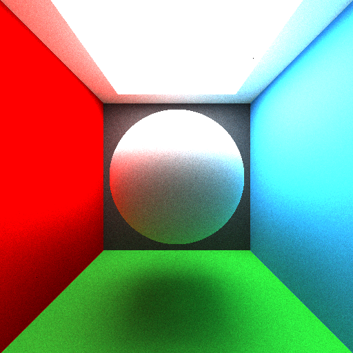
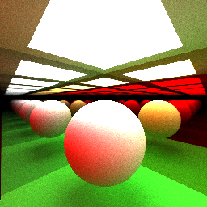
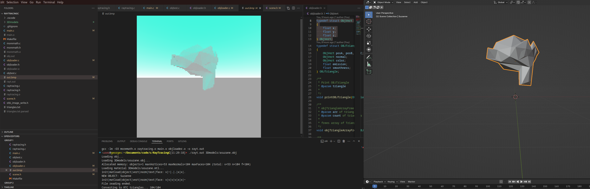

# CPU Raytracer in C

This is a simple raytracing project written in C. It supports basic spheres and triangle intersection, shading, and rendering to image files. An OBJ loader is included to render 3D models.

Some rendered images can be found in [`./images/`](./images/).

## Examples

## Credits

This project is heavily inspired by the work of [Sebastian Lague](https://www.youtube.com/@SebastianLague) on raytracing.
